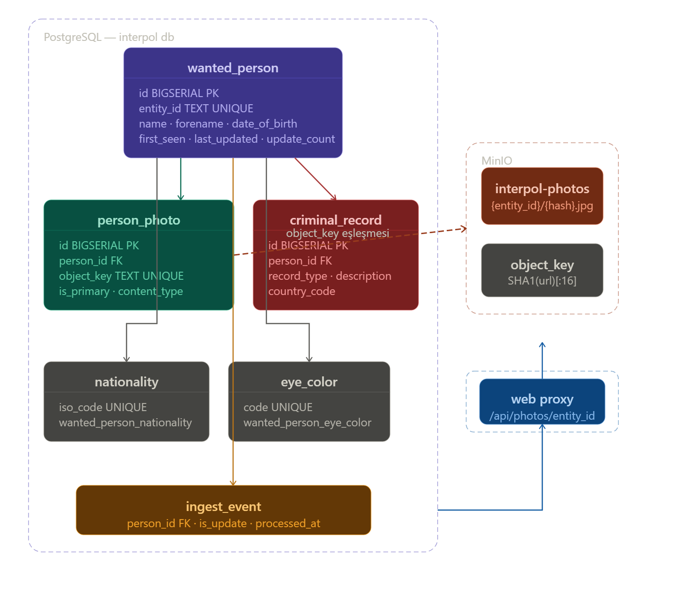
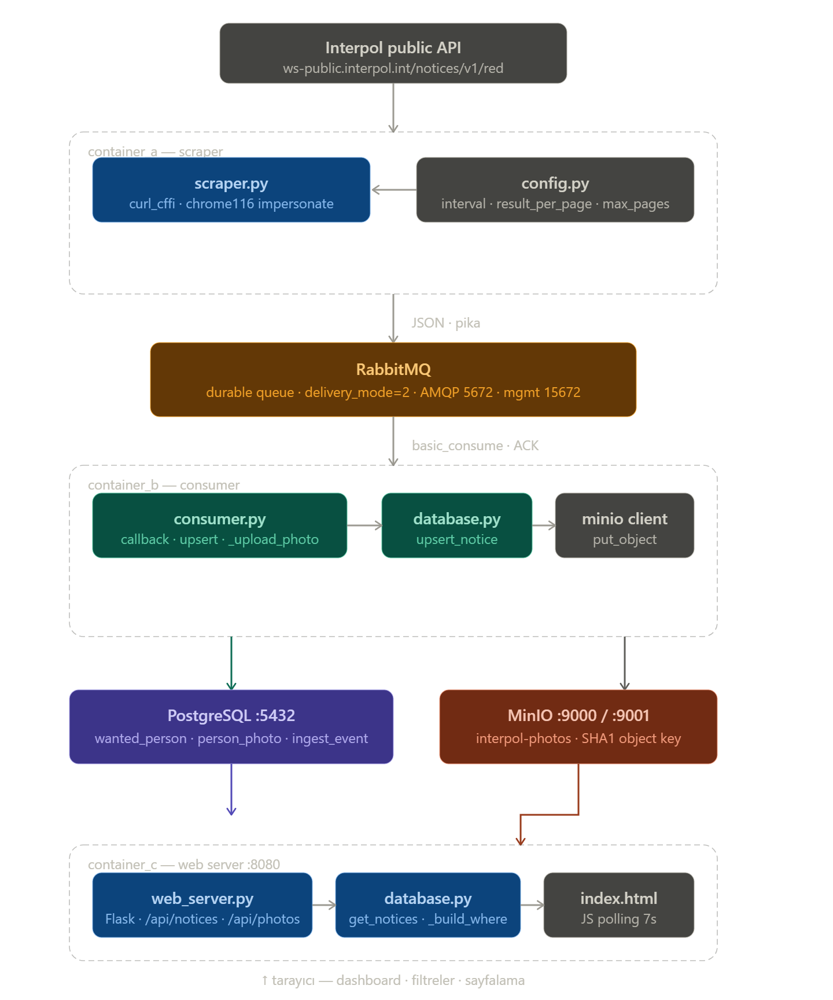

<div align="center">
  
  <h1>⭕ Interpol Red Notice Tracking System</h1>
  <p><i>Asenkron Veri Toplama ve Gerçek Zamanlı Takip Sistemi</i></p>
</div>

---

## 📌 Proje Hakkında
Bu proje, Interpol'ün uluslararası "Kırmızı Bülten (Red Notice)" veritabanını düzenli periyotlarla tarayan, elde ettiği arananlar listesini asenkron bir mesaj kuyruğu (Message Broker) üzerinden güvenle geçirerek **PostgreSQL** veri tabanına işleyen ve web üzerinden görselleştiren bir **Mikroservis (Microservices)** uygulamasıdır.

Sistem dış etkenlere karşı dayanıklı, ölçeklenebilir ve **Docker** ile tamamen konteynerize edilmiş bir mimariyle tasarlanmıştır. Fotoğraflar **MinIO (S3 uyumlu)** obje deposunda saklanır ve web sunucusu üzerinden proxy edilir.

### 🧭 Mimari Diyagramlar





---

## 🏗️ Sistem Mimarisi ve Akış (Pipeline)

Sistemin kalbi birbirinden tamamen izole edilmiş fakat ağ üzerinden senkronize çalışan üç temel modülden oluşur:

### 1- Container A: Bot / Veri Toplayıcı (Scraper)
Görevi yalnızca Interpol sisteminden veri koparmaktır.
- Interpol'ün API'sine düzenli istekler gönderir. 
- Karşı tarafın güvenlik güvenlik cihazlarına (WAF/Cloudflare vb.) yakalanmamak için `curl_cffi` modülünü kullanır ve ağ üzerinde kendini "Google Chrome" tarayıcısıymış gibi gösterir (TLS Spoofing).
- Gelen ham veriyi filtreleyip sadece gerekli bilgileri paketler ve **RabbitMQ**'ya teslim eder. İşi bitince bir sonraki tarama süresine kadar beklemeye geçer.

### 2- RabbitMQ: Mesaj Kuyruğu (Message Broker)
**Container A** ile **Container B** arasındaki köprü görevini üstlenir. Scraper'ın çektiği yoğun verileri geçici belleğinde depolar ve yığın halde gelmesini engelleyerek alıcı taraf olan Consumer servisine verileri tek tek, güvenli bir şekilde sevk eder.

### 3- Container B: İşleyici (Queue Consumer)
RabbitMQ kuyruğunu pür dikkat dinler. Yeni veri geldiğinde alır ve anında kalıcı **PostgreSQL** veritabanına ekler. Eğer kişi zaten eşleşiyorsa üzerine yazar ve güncelleme sayısını artırır.
- Fotoğrafları Interpol üzerinden indirir ve **MinIO** obje deposuna yükler.
- Her ingest işlemi için **ingest_event** kaydı üretir.

### 4- PostgreSQL: Kalıcı Veri Tabanı
İşlenmiş kişi bilgilerini, arama filtrelerini ve güncelleme geçmişini tutar. Arayüzdeki filtreleme ve sıralama işlemleri SQL tarafında yapılır.

### 5- Container C: Web Sunucusu (Flask API + Dashboard)
Kullanıcılara modern bir arayüz (Dashboard) sunar. Filtreleme, sıralama ve sayfalama işlemleri backend API üzerinden yapılır.
- `/api/notices`: Sunucu tarafı filtreleme ve sayfalama.
- `/api/updates`: Son ingest olayları.
- `/api/photos/<entity_id>`: MinIO'dan fotoğraf proxy.

---

## 💻 Kullanılan Teknolojiler
- **Python 3.x**
- **Docker Compose** *(Konteyner Yönetimi & Orkestrasyon)* 🐳
- **RabbitMQ** *(Mesaj Kuyruğu & AMQP Protokolü)* 🐇
- **Flask** *(Web Framework & REST API)* 🌶️
- **PostgreSQL 16** *(İlişkisel ve Kalıcı Veritabanı)* 🐘
- **MinIO** *(S3 Uyumlu Obje Deposu)* 🪣
- **curl_cffi** *(Güvenlik Duvarı Bypass ve Bot Gizleme)* 🥷 
- **HTML5, CSS3, Vanilla JS** *(Dinamik Ön-yüz Tasarımı)* 🎨

---

## 🚀 Hızlı Başlangıç & Kurulum

Sistemi çalıştırmak için bilgisayarınızda sadece **Docker Desktop**'ın kurulu olması yeterlidir.

1- Terminalinizi proje klasöründe açın ve projeyi inşa edip başlatın:
```bash
docker-compose up -d --build
```
> *(Bu işlem sistemin ihtiyaç duyduğu imajları indirecek ve üç ayrı servisi tek bir ağ içinde çalıştıracaktır.)*

2- Servisler `Healthy` (Sağlıklı) durumuna geldiğinde tarayıcınızdan aşağıdaki adreslere gidebilirsiniz:
* 🌐 **Canlı Web İzleme Paneli (Dashboard):** [http://localhost:8080](http://localhost:8080)
* ⚙️ **RabbitMQ Geliştirici Yönetim Ekranı:** [http://localhost:15672](http://localhost:15672)  *(Varsayılan kullanıcı/şifre: `guest` / `guest`)*
* 🪣 **MinIO Console:** [http://localhost:9001](http://localhost:9001) *(Kullanıcı/şifre `.env` ile belirlenir)*
* 🧰 **MinIO S3 API:** [http://localhost:9000](http://localhost:9000)

3- Sistemi tamamen durdurmak ve temizlemek için:
```bash
docker-compose down
```

---

## 📂 Dosya Hiyerarşisi

Sistem bileşenleri kofigürasyonlarına göre şu şekilde ayrılmıştır:

```text
├── docker-compose.yml       # Servis bağlarını, Volume'ları ve Ağları kuran Orkestratör dosya.
├── sql/                     # PostgreSQL ilk kurulum şeması.
│   └── init.sql
│
├── container_a/             # 🕵️‍♂️ (SCRAPER SERVİSİ)
│   ├── scraper.py           # Interpol'den veri çeken ve kuyruğa yollayan bot yazılımı.
│   ├── config.py            # Botun ağ bağlatı ayarları ve tarama süresi konfigürasyonları.
│   ├── Dockerfile           # Servis A'nın yaratım adımları.
│   └── requirements.txt     # Botun kullanacağı python paketleri listesi.
│
├── container_b/             # 🧩 (CONSUMER SERVİSİ)
│   ├── consumer.py          # RabbitMQ dinleyicisi ve MinIO yükleyicisi.
│   ├── database.py          # PostgreSQL upsert ve ilişki yönetimi.
│   ├── config.py            # RabbitMQ, PostgreSQL, MinIO ayarları.
│   ├── Dockerfile           # Servis B'nin yaratım adımları.
│   └── requirements.txt     # Consumer için python paketleri.
│
└── container_c/             # 🖥️ (WEB API & DASHBOARD)
  ├── web_server.py        # Flask API ve dashboard servisi.
  ├── database.py          # Okuma sorguları ve filtreleme.
  ├── config.py            # PostgreSQL/MinIO ve yayın portu (8080) ayarları.
  ├── Dockerfile           # Servis C'nin yaratım adımları.
  ├── requirements.txt     # Web servisi python paketleri.
  └── templates/
    └── index.html       # Kullanıcının gördüğü dashboard arayüzü.
```

